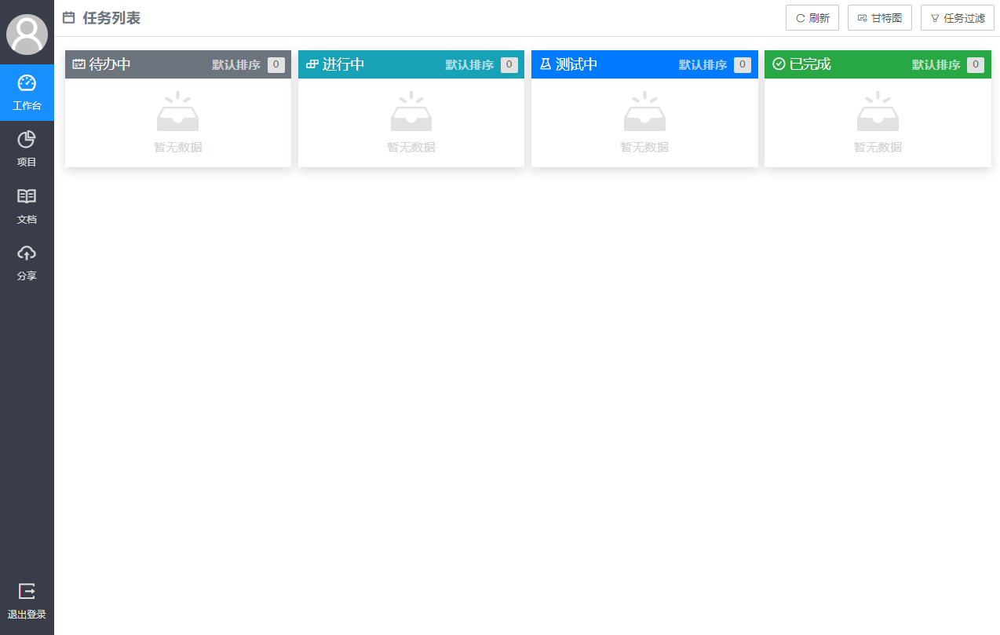

# Team

小团队协作平台（任务管理系统）。**IE等旧浏览器不支持。推荐Chrome**



## 实现功能

+ [x] 可视化配置部署
+ [x] 系统管理
    - [x] 帐号管理
    - [x] 项目管理
+ [x] 个人信息
    - [x] 修改
    - [x] 通知
+ [x] 任务管理
    - [x] 发布任务
    - [x] 任务流
    - [x] 看板
    - [x] 甘特图
    - [x] 过滤
    - [x] 评论
    - [x] 事件回顾
+ [x] 项目管理
    - [x] 人员配置
    - [x] 分支
    - [x] 周报
    - [x] 项目任务
+ [x] 文档
+ [x] 文件分享

## 使用说明

1. [发行版](https://gitee.com/love_linger/Team/releases)中提供Windows与Linux的可执行文件。MacOS用户需要按2说明，自行编译

2. 自行编译说明。  

    2.1 环境

    * Go 1.12+  
    * Node.js
    * Git  

    2.2 编译生成可执行文件

    ```shell
    # 第一步生成前端JS代码
    cd view
    npm install
    npm run build

    # 第二步生成可执行文件
    cd ..
    go build

    # 第三步使用Go.Rice将资源文件打包入可执行文件中，如果不打入包中，需要将view/dist/目录也放入部署环境
    # 【注1】Go.Rice的安装方式`go get github.com/GeertJohan/go.rice/rice`
    # 【注2】windows下`--exec`后面的参数需要加上.exe后缀
    rice append --exec team
    ```

3. 运行team可执行文件，访问 http://localhost:8080 进行配置

## 源代码说明

为方便二次开发，对源代码结构进行统一说明

    repo
    |-- controller                  - 控制器
    |   |-- admin.go                    - 处理 /admin/* 的请求 （系统管理功能）
    |   |-- documents.go                - 处理 /api/document/* 的请求 （文档管理）
    |   |-- file.go                     - 处理 /api/file/* 的请求 （文件管理）
    |   |-- home.go                     - 处理 / 的请求（主页）
    |   |-- install.go                  - 处理 /install/* 的请求（网站部署功能）
    |   |-- loginout.go                 - 处理 /login 及 /logout 的请求（登录/登出功能）
    |   |-- notice.go                   - 处理 /api/notice/* 的请求（通知功能）
    |   |-- project.go                  - 处理 /api/project/* 的请求（项目模块）
    |   |-- task.go                     - 处理 /api/task/* 的请求（任务模块）
    |   |-- user.go                     - 处理 /api/user/* 的请求（个人信息管理）
    |
    |-- middleware                  - 中间件
    |   |-- authorization.go            - 权限相关
    |   |-- logger.go                   - 访问日志记录
    |   |-- panic_as_error.go           - 统一的错误处理
    |   |-- prerequisites.go            - 部署检测
    |
    |-- model                       - 数据模型
    |   |-- cache.go                    - 运行期必要的缓存
    |   |-- environment.go              - 环境配置数据定义
    |   |-- schemas.go                  - 核心数据类型定义（也是数据库中表结构定义）
    |   |-- token.go                    - 自动登录的数据定义
    |   
    |-- orm                         - ORM
    |   |-- orm.go                      - 实现的一个简单的golang struct与MySQL表映射的ORM库
    |
    |-- view                        - 视图层（纯前端，非服务器渲染）
    |   |-- dist                        - 静态文件（包含生成好的js bundle）
    |   |-- src                         - 前端代码（React + TypeScript）
    |   |   |-- common                      - 通信协议、常用函数、常用类
    |   |   |-- components                  - 实现的组件库，样式参考了antd与layui
    |   |   |-- pagas                       - 页面实现
    |   |   |-- app.tsx                     - 主入口
    |   |
    |   |-- package.json                - NPM依赖（建议使用cnpm安装）
    |   |-- tsconfig.json               - TypeScript配置
    |   |-- webpack.config.js           - webpack配置（打包js bundle的命令：npm run build）
    |
    |-- web                         - 网络框架
    |   |-- context.go                  - HTTP Context定义
    |   |-- logger.go                   - 日志工具
    |   |-- responser.go                - 响应类
    |   |-- router.go                   - 路由组件实现
    |   |-- session.go                  - 会话功能
    |   |-- value.go                    - 参数
    |
    |-- go.mod                      - golang工程依赖
    |-- main.go                     - 主入口


