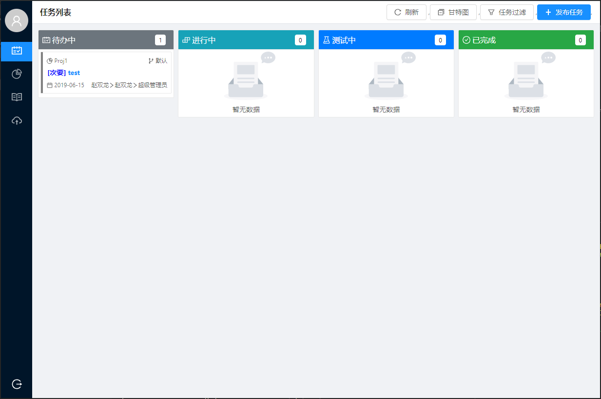

# Team

小团队协作平台（任务管理系统）



## 重要声明

1. **2.0后的版本为完全重构版，与之前lua服务器版不再兼容。不要尝试直接升级！！！**
2. 原`lua`版不再维护。

## 实现功能

+ [x] 可视化配置部署
+ [x] 系统管理
    - [x] 帐号管理
    - [x] 项目管理
+ [x] 个人信息
    - [x] 修改
    - [x] 通知
+ [x] 任务管理
    - [x] 发布任务
    - [x] 任务流
    - [x] 看板
    - [x] 甘特图
    - [x] 过滤
    - [x] 评论
    - [x] 事件回顾
+ [x] 项目管理
    - [x] 人员配置
    - [x] 分支
    - [x] 周报
    - [x] 项目任务
+ [x] 文档
+ [x] 文件分享

## 使用说明

1. 对于不需要修改原码的用户，可直接从[发行版](https://gitee.com/love_linger/Team/releases)页面中下载编译好的可执行文件，放入`publish`目录中，然后直接第3步

2. 对于有需求修改原码的用户，修改完后可按下面的步骤自行编译。  

    2.1 环境

    * Go 1.12+  
    * Node.js
    * Git  

    2.2 前端

    ```shell
    # 拉取依赖
    cd frontend
    npm install

    # 编译生成 publish/www/app.js。【注意】如果使用默认配置，生成的js使用es6
    npm run build
    ```

    2.3 后端

    ```shell
    # 编译生成可执行文件
    cd backend
    go build -o ../publish/team.exe
    ```

3. 将 `publish` 目录下的文件拷贝到服务器部署路径

4. 运行：team。默认端口8080。【注】该版本已内置部署功能，初次访问会进行配置。


